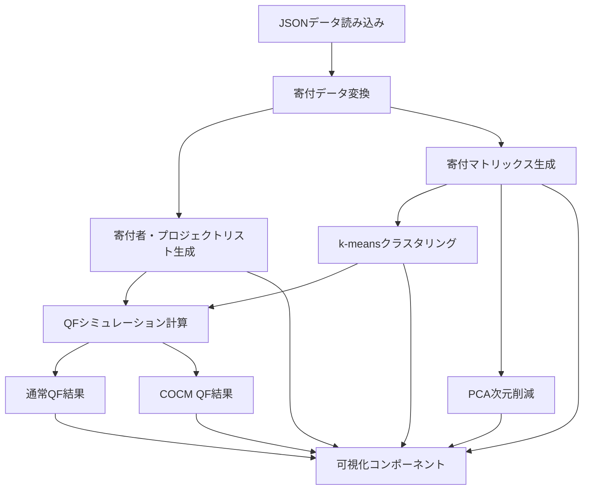

# 設計書：DIGSHIBUYA QF シミュレーション比較アプリケーション

## 1. 概要

このアプリケーションは、寄付データを分析し、二種類の四次関数資金調達（Quadratic Funding、QF）アルゴリズム（通常QFとCOCM QF）の比較シミュレーションを行うためのツールです。寄付者とプロジェクト間の関係性を様々な視点から分析し、異なるQFアルゴリズムがマッチングファンドの配分にどのような影響を与えるかを視覚的に示します。

## 2. システムアーキテクチャ

### 2.1 技術スタック

- **フロントエンド**: React 17（CDN経由でのUMD版）
- **トランスパイラ**: Babel（ブラウザ内でJSXをトランスパイル）
- **データ可視化**: Plotly.js
- **数値計算**: numeric.js（PCA計算用）
- **スタイリング**: インラインCSS

### 2.2 アプリケーション構造

```
単一ページアプリケーション（SPA）
├── HTML構造
│   └── root div（Reactマウントポイント）
├── スタイル定義（インラインCSS）
├── 外部ライブラリ読み込み
│   ├── React
│   ├── ReactDOM
│   ├── Babel
│   ├── Plotly.js
│   └── numeric.js
└── Reactコンポーネント
    ├── 数学的アルゴリズム関数
    │   ├── kMeansClusteringWithAssignments
    │   └── pcaProjection
    └── DonationSimulator（メインコンポーネント）
        ├── 状態管理（React Hooks）
        ├── データ変換ロジック（useMemo）
        ├── QFシミュレーションロジック
        ├── 可視化コンポーネント（Plotly）
        └── UIレンダリング（JSX）
```

## 3. データフロー



## 4. 主要コンポーネントと機能

### 4.1 数学的アルゴリズム

#### 4.1.1 k-meansクラスタリング
- **目的**: 寄付者を寄付パターンに基づいて分類
- **入力**: 寄付マトリックス（行=寄付者、列=プロジェクト）
- **出力**: クラスタ割り当てとセントロイド
- **アルゴリズム**:
  1. 初期セントロイドをデータポイントから選択（または生成）
  2. 各データポイントを最も近いセントロイドに割り当て
  3. 各クラスタの新しいセントロイドを計算
  4. 収束するまで2-3を繰り返す
- **実装の特徴**:
  - データ不足時のランダム初期中心点生成
  - 無限ループ防止のための最大反復回数制限
  - エラーハンドリングによる堅牢性

#### 4.1.2 PCA（主成分分析）
- **目的**: 高次元の寄付データを2次元に射影して可視化
- **入力**: 寄付マトリックス
- **出力**: 2次元座標
- **アルゴリズム**:
  1. データを中心化
  2. SVD（特異値分解）を計算
  3. 上位2つの主成分に射影
- **実装の特徴**:
  - 行数が列数より少ない場合の簡易的な次元削減
  - エラー発生時の簡易的な座標生成によるフォールバック
  - 3次元射影のサポート

### 4.2 QFシミュレーション

#### 4.2.1 通常QF
- **基本スコア計算**: 各寄付額の平方根の合計を二乗
- **多様性係数**: 寄付者クラスタの多様性に基づく係数（クラスタ数/最大クラスタ数）
- **最終スコア**: 基本スコア × 多様性係数
- **マッチング額**: 最終スコアに比例して配分

#### 4.2.2 COCM QF
- **基本スコア計算**: 通常QFと同じ
- **多様性係数**: 通常QFの多様性係数 + 0.5（コミュニティ指向ボーナス）
- **最終スコア**: 基本スコア × 強化された多様性係数
- **マッチング額**: 最終スコアに比例して配分

### 4.3 可視化コンポーネント

#### 4.3.1 Sankey Diagram
- **目的**: 寄付者からプロジェクトへの資金フローを視覚化
- **データ**: 寄付リンク（寄付者、プロジェクト、金額）
- **実装の特徴**:
  - プロジェクトIDから名前への変換
  - ノードとリンクのマッピング
  - ダークモード対応のスタイリング

#### 4.3.2 3D Network Visualization
- **目的**: 寄付者とプロジェクトの関係性を3D空間で表現
- **データ処理**:
  - プロジェクトと寄付者のマッピング
  - 寄付統計の計算（寄付総額、寄付者数など）
  - 排他的寄付者（そのプロジェクトにのみ寄付している人）の識別
- **位置計算**:
  - フォースシミュレーションによるノード配置
  - 反発力と引力のバランス調整
  - 寄付額に応じた引力の重み付け
- **視覚化**:
  - プロジェクト：青色の球体（寄付総額に応じたサイズ）
  - 寄付者：赤色の小さな点
  - 寄付関係：緑色の線
  - ホバー情報：プロジェクト名、寄付者数、寄付総額など

#### 4.3.3 2D Clustering Visualization
- **目的**: 寄付者のクラスタリング結果をPCAで2次元に射影して表示
- **データ**: PCA座標とクラスタ割り当て
- **実装の特徴**:
  - クラスタごとに異なる色で表示
  - 視覚的分離のためのジッター追加
  - ダークモード対応のスタイリング

#### 4.3.4 QF比較グラフ
- **バーチャート**: プロジェクト別の寄付総額とマッチング額
- **ラインチャート**: 順位別割り当て総額の配分
- **累積資金配分グラフ**: 資金配分の公平性を示す累積曲線
- **実装の特徴**:
  - 通常QFとCOCM QFを左右に並べて表示
  - プロジェクト名の表示（Grants.jsonから取得）
  - ダークモード対応のスタイリング

## 5. 状態管理

### 5.1 主要な状態変数
- `matchingPool`: マッチングファンドのプール額（デフォルト: 1,000,000円）
- `refresh`: データ再読み込みのトリガー
- `rawDonationData`: JSONから読み込んだ生の寄付データ
- `isLoading`: データ読み込み中フラグ
- `error`: エラー状態

### 5.2 派生データ（useMemo）
- `donors`: 一意な寄付者リスト
- `projects`: 一意なプロジェクトリスト
- `tableData`: 寄付者×プロジェクトの寄付額テーブル
- `links`: 寄付フロー用のリンクデータ
- `donationMatrix`: クラスタリング用の数値行列
- `assignments`: クラスタリング結果
- `projectSummaries_normal`: 通常QFの計算結果
- `projectSummaries_cocm`: COCM QFの計算結果

## 6. エラーハンドリング

- **データ読み込みエラー**: fetch APIのエラーハンドリングとユーザーへの表示
- **アルゴリズムエラー**: 各アルゴリズム（k-means、PCA）内のtry-catchによるエラー処理
- **可視化エラー**: 各可視化コンポーネントでのtry-catchとコンソールへのエラーログ
- **データ検証**: 不正なデータ入力に対する防御的プログラミング（nullチェック、長さチェックなど）
- **DOM要素チェック**: 可視化前のDOM要素存在確認

## 7. パフォーマンス最適化

- **メモ化**: `useMemo`による派生データの計算キャッシュ
- **メモリリーク防止**: コンポーネントのマウント状態追跡とクリーンアップ関数
- **遅延レンダリング**: 可視化コンポーネントの遅延レンダリング（setTimeout）
- **条件付きレンダリング**: データ不足時の描画スキップ
- **効率的なデータ処理**: Set、Mapなどを使用した効率的なデータ構造

## 8. 拡張性と将来の改善点

### 8.1 コード構造の改善
- 単一ファイルから複数コンポーネントへの分割
- カスタムフックによるロジックの分離
- 型安全性のためのTypeScript導入
- モジュールバンドラー（Webpack、Parcelなど）の導入

### 8.2 機能拡張
- 追加のQFアルゴリズムバリエーション
- クラスタ数の動的調整機能
- インタラクティブな可視化（ドリルダウン、フィルタリング）
- 寄付者・プロジェクト詳細情報の表示

### 8.3 パフォーマンス向上
- WebWorkerによる計算負荷の分散
- 大規模データセット対応のための仮想化
- 3Dレンダリングの最適化（WebGL活用）
- プログレッシブローディングの実装

## 9. 依存関係

- **React 17.x**: UIコンポーネントライブラリ
- **ReactDOM 17.x**: DOMレンダリング
- **Babel 6.x**: JSXトランスパイル
- **Plotly.js**: データ可視化
- **numeric.js 1.2.6**: 数値計算（PCA実装）

## 10. 制約と前提条件

- **ブラウザ互換性**: モダンブラウザのサポート（古いブラウザでは動作しない可能性）
- **データ要件**:
  - `Contribution.json`: 寄付データ（userId, grantId, amount）
  - `Grants.json`: プロジェクト情報（id, name）
- **パフォーマンス制約**: 大量のデータや複雑な3D描画は低スペックデバイスで遅延する可能性
- **クライアントサイド処理**: すべての計算とレンダリングはクライアント側で実行
- **ブラウザ内トランスパイル**: 本番環境では事前ビルドが望ましい
