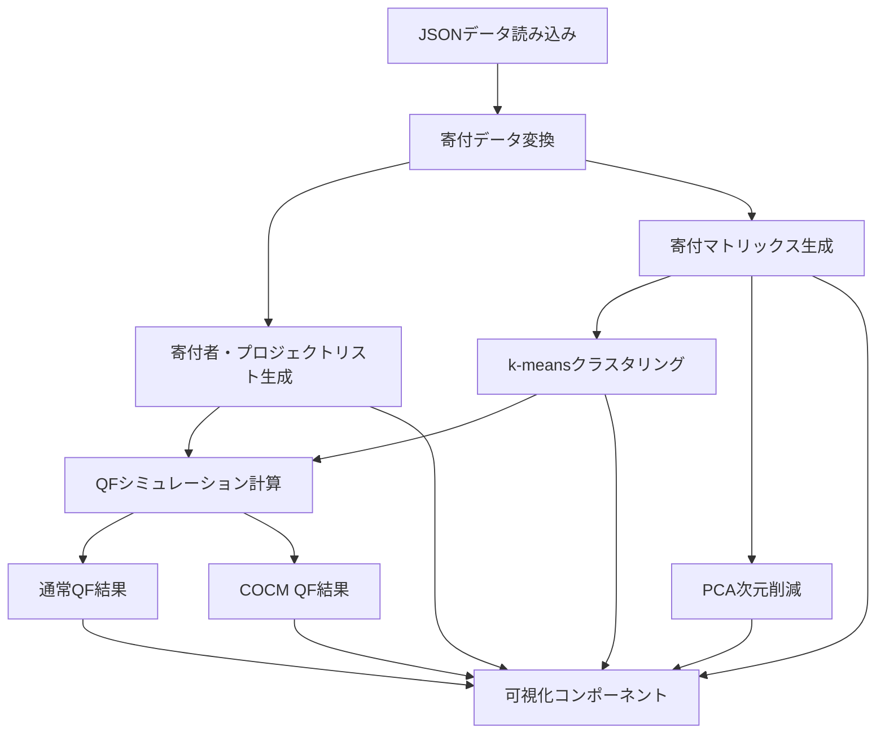

# 設計書：寄付フロー＆QFシミュレーション比較アプリケーション

## 1. 概要

このアプリケーションは、寄付データを視覚化し、二種類の四次関数資金調達（Quadratic Funding、QF）アルゴリズム（通常QFとCOCM QF）のシミュレーション結果を比較するためのツールです。寄付者とプロジェクト間の関係性を様々な視点から分析し、異なるQFアルゴリズムがマッチングファンドの配分にどのような影響を与えるかを示します。

## 2. システムアーキテクチャ

### 2.1 技術スタック

- **フロントエンド**: React（CDN経由でのUMD版）
- **トランスパイラ**: Babel（ブラウザ内でJSXをトランスパイル）
- **データ可視化**: Plotly.js
- **数値計算**: numeric.js（PCA計算用）
- **スタイリング**: インラインCSS

### 2.2 アプリケーション構造

```
単一ページアプリケーション（SPA）
├── HTML構造
│   └── root div（Reactマウントポイント）
├── スタイル定義（インラインCSS）
├── 外部ライブラリ読み込み
└── Reactコンポーネント
    ├── 数学的アルゴリズム関数
    │   ├── kMeansClusteringWithAssignments
    │   └── pcaProjection
    └── DonationSimulator（メインコンポーネント）
        ├── 状態管理
        ├── データ変換ロジック
        ├── QFシミュレーションロジック
        ├── 可視化コンポーネント（Plotly）
        └── UIレンダリング
```

## 3. データフロー



## 4. 主要コンポーネントと機能

### 4.1 数学的アルゴリズム

#### 4.1.1 k-meansクラスタリング
- **目的**: 寄付者を寄付パターンに基づいて分類
- **入力**: 寄付マトリックス（行=寄付者、列=プロジェクト）
- **出力**: クラスタ割り当てとセントロイド
- **アルゴリズム**:
  1. 初期セントロイドをデータポイントから選択（または生成）
  2. 各データポイントを最も近いセントロイドに割り当て
  3. 各クラスタの新しいセントロイドを計算
  4. 収束するまで2-3を繰り返す

#### 4.1.2 PCA（主成分分析）
- **目的**: 高次元の寄付データを2次元に射影して可視化
- **入力**: 寄付マトリックス
- **出力**: 2次元座標
- **アルゴリズム**:
  1. データを中心化
  2. SVD（特異値分解）を計算
  3. 上位2つの主成分に射影

### 4.2 QFシミュレーション

#### 4.2.1 通常QF
- **基本スコア計算**: 各寄付額の平方根の合計を二乗
- **多様性係数**: 寄付者クラスタの多様性に基づく係数（クラスタ数/最大クラスタ数）
- **最終スコア**: 基本スコア × 多様性係数
- **マッチング額**: 最終スコアに比例して配分

#### 4.2.2 COCM QF
- **基本スコア計算**: 通常QFと同じ
- **多様性係数**: 通常QFの多様性係数 + 0.5（コミュニティ指向ボーナス）
- **最終スコア**: 基本スコア × 強化された多様性係数
- **マッチング額**: 最終スコアに比例して配分

### 4.3 可視化コンポーネント

#### 4.3.1 Sankey Diagram
- **目的**: 寄付者からプロジェクトへの資金フローを視覚化
- **データ**: 寄付リンク（寄付者、プロジェクト、金額）

#### 4.3.2 3D Network Visualization
- **目的**: 寄付者とプロジェクトの関係性を3D空間で表現
- **データ構造**:
  - プロジェクト: 円状に配置
  - 寄付者: 寄付先プロジェクトの重み付き平均位置 + ランダムジッター
  - エッジ: 寄付関係を表す線

#### 4.3.3 2D Clustering Visualization
- **目的**: 寄付者のクラスタリング結果をPCAで2次元に射影して表示
- **データ**: PCA座標とクラスタ割り当て

#### 4.3.4 QF比較グラフ
- **バーチャート**: プロジェクト別の寄付総額とマッチング額
- **ラインチャート**: 順位別割り当て総額の配分
- **累積資金配分グラフ**: 資金配分の公平性を示す累積曲線

## 5. 状態管理

### 5.1 主要な状態変数
- `matchingPool`: マッチングファンドのプール額
- `refresh`: データ再読み込みのトリガー
- `rawDonationData`: JSONから読み込んだ生の寄付データ
- `isLoading`: データ読み込み中フラグ
- `error`: エラー状態

### 5.2 派生データ（useMemo）
- `donors`: 一意な寄付者リスト
- `projects`: 一意なプロジェクトリスト
- `tableData`: 寄付者×プロジェクトの寄付額テーブル
- `links`: 寄付フロー用のリンクデータ
- `donationMatrix`: クラスタリング用の数値行列
- `assignments`: クラスタリング結果
- `projectSummaries_normal`: 通常QFの計算結果
- `projectSummaries_cocm`: COCM QFの計算結果

## 6. エラーハンドリング

- データ読み込みエラーの捕捉と表示
- 各アルゴリズム（k-means、PCA）内のtry-catchによるエラー処理
- 可視化コンポーネントのエラー処理とフォールバック
- 不正なデータ入力に対する防御的プログラミング

## 7. パフォーマンス最適化

- `useMemo`による派生データの計算キャッシュ
- コンポーネントのマウント状態追跡によるメモリリーク防止
- 可視化コンポーネントの遅延レンダリング（setTimeout）
- DOM要素の存在確認による不要な描画回避

## 8. 拡張性と将来の改善点

### 8.1 コード構造の改善
- 単一ファイルから複数コンポーネントへの分割
- カスタムフックによるロジックの分離
- 型安全性のためのTypeScript導入

### 8.2 機能拡張
- 追加のQFアルゴリズムバリエーション
- より高度なクラスタリングオプション
- インタラクティブな可視化（ドリルダウン、フィルタリング）
- リアルタイムデータ連携

### 8.3 パフォーマンス向上
- WebWorkerによる計算負荷の分散
- メモ化によるレンダリング最適化
- 大規模データセット対応のための仮想化

## 9. 依存関係

- React 17.x
- ReactDOM 17.x
- Babel standalone 6.x
- Plotly.js (latest)
- numeric.js 1.2.6

## 10. 制約と前提条件

- ブラウザ内でのJSXトランスパイル（本番環境では事前ビルドが望ましい）
- 外部JSONファイル（Contribution.json）の存在と特定の形式
- モダンブラウザのサポート（古いブラウザでは動作しない可能性）
- クライアントサイドのみの実装（サーバーサイド処理なし）
